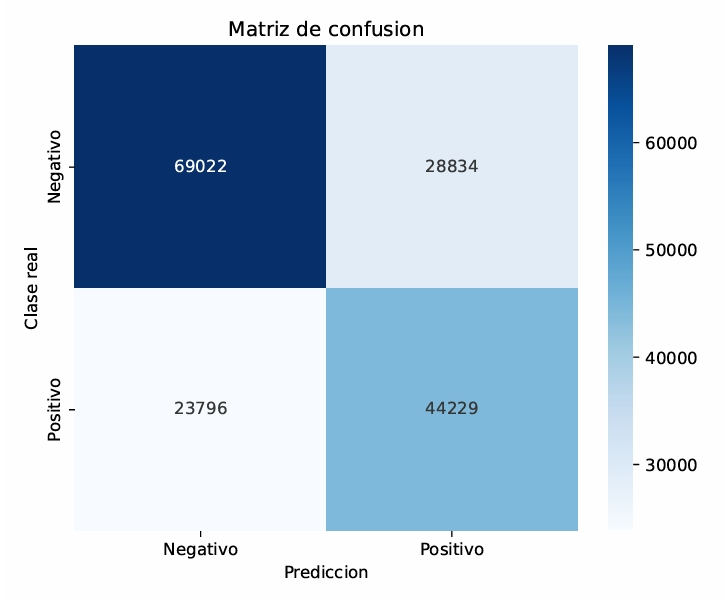

# Keylogger Detection with Machine Learning

This project focuses on detecting keyloggers (malicious software that records keyboard inputs) using various supervised machine learning algorithms. The objective is to classify whether input patterns are suspicious or normal based on extracted features.

---

## Models Applied

- **Principal Component Analysis (PCA)**
- **Lasso Regression** for feature selection
- **XGBoost** (best performing model)
- **Neural Networks** (Keras)

---

## Best Model – XGBoost

XGBoost yielded the best results in terms of recall and balanced accuracy. Below is the confusion matrix for the final model:

---

## Tools Used

- Language: **R**
- Libraries: `caret`, `xgboost`, `randomForest`, `e1071`, `keras`, `yardstick`

---

## Files

- `KeyloggerFinal.Rmd`: Main code and step-by-step implementation
- `Keylogger.jpeg`: Confusion matrix of the XGBoost model

---

## Insights

- XGBoost outperformed other models in both precision and recall.
- PCA and Lasso helped reduce dimensionality and improve performance.
- Neural networks performed well but required more tuning to generalize.

---

## Author

**Anıl Can Tekin**  
Master’s Student in Big Data – University of Murcia  
